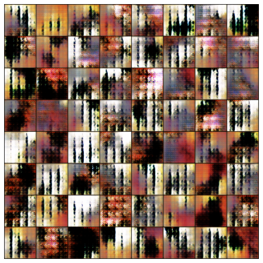

# Project Proposal

## 1 - Introduction and Background

Our project focuses primarily on the use of neural network based generative modeling for the rendering of realistic looking artwork. Recent advancements in deep learning, largely a result of modern computing architectures, have lead to the creation of models that can learn to generate realistic looking data. Models like Generative Adversarial Networks (GANs)[1], which we utilize in this paper, learn a mapping from a latent vector space that encodes the features necessary to generate data to synthetic data in the domain of an input dataset. GANs do this useing a game theoretic approach of pitting two agents, a generator and a descriminator, against eachother to help eachother learn. Other approaches like Variational Autoencoders attempt to construct generative models of data by attempting to compress data and learn a reconstruction of the data. Our project focuses on using both GANs and VAEs to learn representations of paintings that allow for the generation of synthetic paintings. 

### 1.1 - Generative Adversarial Networks (GANs)

Generative Adversarial Networks (GANs) are a neural network architecture composed of two parts:

1. They have a Generator that attempts to map what is called a latent vector space, pulled from a set of random distributions like Gaussians, to the space in which data lives.

2. GANs also have a Discriminator, which maps from a vector space of the data distribution to a binary classification of whether or not the data given to the network is real or counterfeit.

The purpose of this architecture is to learn a Generator that can create data that looks like it is from the distribution of real data. The Generator and Discriminators play a min-max game in which they make each other better over time. The Generator tries to outsmart the Discriminator and vice versa. These models are trained in an unsupervised manner using the above described min-max game optimization. [1] 

### 1.2 - Variational Autoencoders (VAEs)

Variational Autoencoders are a type of neural network that attempts to learn a probability function p(z|x) mapping input data x to a latent space z, as well as a function p(x|z) that does the opposite mapping from a latent space z to the input domain x. VAEs have two parts:

1. They have an Encoder that maps data from an input domain x(images, songs) to a typically smaller vector z that encodes the parameters of a probability distrubiton, typically Gaussian(in this case mean and standard deviation) 
2. They have a Decoder that maps the compressed vector space z back to the input domain x using only the information from the vector.

Both the encoder and decoder are trained using a combination of two optimization functions. One of the constraints encourages the minimization of reconstruction error, which is loosely how the input x differs from its reconstructed counterpart x'. The second term is a KL divergence term that encourages the mapping p(z|x) that the encoder learns to fit the same proability distribution p(z), which is typically Gaussian. The variational component of VAEs encourages the learning of robust representations that fit the initial data distribution. 

### 1.3 - Convolutional Neural Networks

Convolutional Neural Networks (CNNs) are deep learning models that employ "convolutional" filters that scan across the domain of an input distrubution to learn a desired output distribution. The key component of CNNs is the convolutional filter that moves across the X and Y spatial dimensions of images, computing a dot product at each location. These filters learn features that are equivariant(change independent of) to translation. Images have many features, like eyes or ears in a face dataset, that can be present at any location in an image. CNNs allow the sharing of parameters across different the spatial dimensions of data thus lowering the size of the network necessary to learn certain patterns and avoiding all of the problems with having a larger netwrork like slower convergence, overfitting, and slower training time. We employ convolutional layers in our GANs as well as VAEs to more easily learn representations of the image data. 

### 1.4 - CycleGAN

We use a neural network architecture called CycleGAN[3] that enables the learning of image to image translation. CycleGAN is largely based on architecture called pix2pix[TODO Cite] that outlines what is called a conditional GAN. Typical GANs learn mapping from a latent vector z to the input distribution x. The novelty of pix2pix was the addition of conditioning the mapping z to x on an input image p. This takes into account additional information from an input image when rendering the output image x. This could be thought of as learning a mapping from p to x through the intermediate represenation z that is learned in an adversarial fashion. CycleGAN builds on top of pix2pix by both learning the mapping p to x and x to p. This has been shown to lead to better represenations and generated data. This architecture is useful for the application of image to image translation. We use CycleGAN to learn mappings between art data and regular images. 

## 2 - Problem Description

We want to leverage novel machine learning methods to generate realistic looking and aesthetically pleasing art from a dataset of examples. We would also like to be able to render artwork that encompasses certain parameters of a painting like the year, artist, color content, and style. We want to employ the methods described in section 1 to learning generative models based on art datasets. 

## 3 - Data Collection

At this point in the project we primarily used a Kaggle dataset of the Best Artworks of All Time [5]. This dataset included mostly paintings from artitsts like Monet, Da Vinci, and Warhol. We prepared the data by fitting it to a 150x150 grid that shows the central part of the paintings. A secondary dataset that was used was the monet2photo dataset[TODO Cite] that shows mappings between monet paintings and photos of the scenes that those paintings depict. 

## 4 - Methods and Results

Up until this point we have primarily done two experiments. One experiment was using basic GAN architectures trained on the Best Artworks of All Time [5] dataset. The other experiment used the CycleGAN architecture to learn a mapping from monet paintings to real life images depicting their scenes. 

### 4.1 - Vanilla GAN experiment

We trained a GAN that uses sequences of convolutional layers to map from the latent vector z to the input distribution of images from the Best Artworks of All Time. This was a preliminary experiment that had the outputs outlined below. 

### 4.2 - CycleGAN experiment

Teh second experiment we did was utilize the CycleGAN architecture outlined in section 1.4 to perform image to image mapping on images of monet paintings to lifelike images. The results for this are shown below. 

TODO show real and fake images here

## 5 Discussion

This project explores many recent advancements in machine learning and generative modeling. It has a supervised and unsupervised component, and expands our knowledge of various areas of machine learning. We show significant progress towards our initially outlined goals. We had somewhat sucessful results for our Vanilla GAN experiments. We also had significant progress in our CycleGAN experiments in developing a mapping function from monet paintings to real life images. 

## References

- [Goodfellow, Ian, et al. "Generative adversarial nets." Advances in neural information processing systems. 2014.](https://papers.nips.cc/paper/5423-generative-adversarial-nets.pdf) [1]
    - Outlines general GAN approach and gives theoretical background

- [GANGogh: Creating Art with GANs. Introduction](https://towardsdatascience.com/gangogh-creating-art-with-gans-8d087d8f74a1) [2]
    - Describes a novel project similar to ours

- [Zhu, Jun-Yan, et al. "Unpaired image-to-image translation using cycle-consistent adversarial networks." Proceedings of the IEEE international conference on computer vision. 2017.](https://arxiv.org/abs/1703.10593) [3]

- [Image Source](https://towardsdatascience.com/cyclegans-to-create-computer-generated-art-161082601709) [4]

- [Kaggle Dataset](https://www.kaggle.com/ikarus777/best-artworks-of-all-time) [5]

