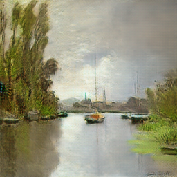
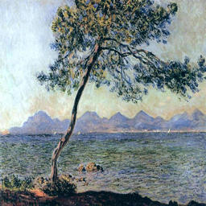
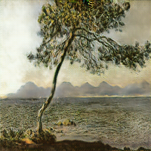
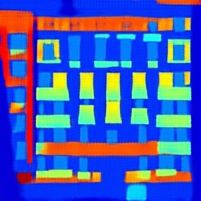
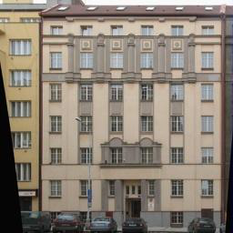
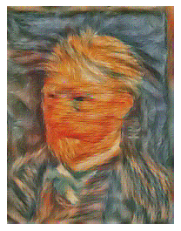

# Project Final Report

## 1 - Introduction and Background

Our project focuses primarily on the use of neural-network-based generative modeling for the rendering of realistic looking artwork.

Recent advancements in deep learning, largely a result of modern computing architectures, have led to the creation of models that can learn to generate realistic looking data. Models like Generative Adversarial Networks (GANs)[1], which we utilize in this project, learn a mapping from a latent vector space that encodes the features necessary to generate data to synthetic data in the domain of an input dataset. GANs do this using a game theoretic approach of pitting two agents, a generator and a discriminator, against each other to help each other learn.

Other approaches like Variational Autoencoders attempt to construct generative models of data by attempting to compress data and learn a reconstruction of the data. Our project focuses on using both GANs and VAEs to learn representations of paintings that allow for the generation of synthetic paintings.

Further, we experiment with Style Transfer to generate interesting representations of existing images with new styles.

### 1.1 - Generative Adversarial Networks (GANs)

Generative Adversarial Networks (GANs) are a neural network architecture composed of two parts:

1. A Generator that attempts to map a latent vector space, pulled from a set of random distributions such as Gaussians, to the space in which data lives.

2. A Discriminator, which maps from a vector space of the data distribution to a binary classification of whether or not the data given to the network is real or counterfeit.

The purpose of this architecture is to learn a Generator that can create data that looks like it is from the distribution of real data. The Generator and Discriminator play a min-max game in which they make each other better over time. The Generator tries to outsmart the Discriminator and vice versa. These models are trained in an unsupervised manner using the above described min-max game optimization. [1]

### 1.2 - Variational Autoencoders (VAEs)

A Variational Autoencoder (VAE)[7] is a machine learning framework that takes a set of data and forms a compressed (latent) representation of data. An encoder function maps data from an input domain (i.e. images, sounds, etc.), to a lower-dimensional latent space that encodes the features necessary to reconstruct the original data.

Additionally, VAEs encode inputs to distributions over latent space, as opposed to individual points. The decoder function reverses the compression by reconstructing the original data from the latent representation. Typically these decoder and encoder functions are parameterized by neural networks, but it is a flexible framework that can be used with other methods. The VAEs are trained by jointly optimizing for reconstruction of the input data from the compressed representation, and having the latent space fit a predetermined prior distribution (typically Gaussian). This is done by jointly optimizing via gradient descent the reconstruction error (how well the input was reconstructed from a latent form), and a KL divergence term between the learned posterior distribution and a prior distribution.

This has the effect of both learning how to reconstruct input items, and also having the latent space have the shape of a Gaussian. In contrast to traditional Autoencoders, which don’t have the variational aspect, VAEs are capable of generating realistic looking data from latent space that did not exist in the initial training set. This is because when training, the encoder maps to the parameters of a distribution (i.e. mean and standard deviation in the Gaussian case), and that distribution is randomly sampled from. This sampled latent vector is then mapped out to the input space using the decoder. This causes the latent space of the VAE to be smoother, which is conducive to better representations.

Typical autoencoders are capable of memorizing training data, but are not as good at generating convincing looking data.

More formally, VAEs attempt to learn a probability function p(z|x), which maps input data x to a latent space z, as well as a function p(x|z), which does the opposite mapping from a latent space z to the input domain x. VAEs have two parts:

1. They have an Encoder that maps data from an input domain x (such as images, songs, etc.) to a typically smaller vector, z, which encodes the parameters of a probability distribution, typically Gaussian (in this case mean and standard deviation) 
2. They have a Decoder that maps the compressed vector space z back to the input domain x using only the information from the vector.

The above figure shows the typical VAE architecture. Both the encoder and decoder are trained using a combination of two optimization functions. One of the constraints encourages the minimization of reconstruction error, which is loosely how the input x differs from its reconstructed counterpart x'. The second term is a KL divergence term that encourages the mapping p(z|x) that the encoder learns to fit the same probability distribution p(z), which is typically Gaussian. The variational component of VAEs encourages the learning of robust representations that fit the initial data distribution. 

### 1.3 - Convolutional Neural Networks

Convolutional Neural Networks (CNNs) are deep learning models that employ "convolutional" filters that scan across the domain of an input distribution to learn a desired output distribution. The key component of CNNs is the convolutional filter that moves across the X and Y spatial dimensions of images, computing a dot product at each location. These filters learn features that are equivariant (change independent) to translation. Images have many features, like eyes or ears in a face dataset, that can be present at any location in an image.

CNNs allow the sharing of parameters across different spatial dimensions of data thus lowering the size of the network necessary to learn certain patterns and avoiding all of the problems with having a larger network like slower convergence, overfitting, and slower training time. We employ convolutional layers in our GANs as well as VAEs to more easily learn representations of the image data. 

### 1.4 - CycleGAN

We use a neural network architecture called CycleGAN[3] that enables the learning of image to image translation. CycleGAN is largely based on an architecture called pix2pix[4] that outlines what is called a conditional GAN. Typical GANs learn mapping from a latent vector z to the input distribution x. The novelty of pix2pix was the addition of conditioning the mapping z to x on an input image p. This takes into account additional information from an input image when rendering the output image x. This could be thought of as learning a mapping from p to x through the intermediate representation z that is learned in an adversarial fashion. CycleGAN builds on top of pix2pix by both learning the mapping p to x and x to p. This has been shown to lead to better representations and generated data. This architecture is useful for the application of image to image translation. We use CycleGAN to learn mappings between art data and regular images.

### 1.5 - Style Transfer

We employ style transfer to recompose the content of an image in the style of another. It takes two images—a content image and a style reference image—and blends them together so that the resulting output image retains the core elements of the content image, but appears to be “painted” in the style of the style reference image. This can be used to generate artistic versions of ordinary images, in the target style of an artist, such as creating a Van Gogh styled version of one's own portrait. Using a pre-trained deep Convolutional Network, like VGG or SqueezeNet, we compute three loss functions - content loss, that describes how different the content of two images are, and style loss, that describes the difference between the two images in terms of their style, and total-variation regularization to encourage smoothness in the image. Then, using a style image and a content image, we try to transform the content image to minimize the content loss with the content image and style loss with the style image.

## 2 - Problem Description

We want to leverage novel machine learning methods to generate realistic looking and aesthetically pleasing art from a dataset of examples. We would also like to be able to render artwork that encompasses certain parameters of a painting like the year, artist, color content, and style. We want to employ the methods described in section 1 to learn generative models based on art datasets.

## 3 - Data Collection

We primarily used a Kaggle dataset of the Best Artworks of All Time [5]. This dataset included mostly paintings from artists like Monet, Da Vinci, and Warhol. We prepared the data by fitting it to a 150x150 grid that shows the central part of the paintings. A secondary dataset that was used was the monet2photo dataset[6] that shows mappings between monet paintings and photos of the scenes that those paintings depict. 

## 4 - Methods and Results

Over the course of this project, we have conducted multiple experiments. First, we attempted to use both traditional autoencoders and variational autoencoders (VAEs) on just the images of the paintings from the monet2photo dataset.

Next, we trained basic GAN architectures on the Best Artworks of All Time [5] dataset. In another, we used the CycleGAN architecture to learn a mapping from Monet paintings to real life images depicting their scenes.

Lastly, we performed a neural style transfer experiment on the Best Artworks of All Time [5] dataset to create images based on the appearance and visual style of other images. 

### 4.1 - Autoencoder Experiments

Traditional Autoencoders are similar to VAEs, except they do not learn to map a distribution over the latent space, but instead map directly to latent vectors. We trained an autoencoder over a dataset of Monet paintings.

We learn an encoding mapping from the input space to a latent vector. The values of the neurons at the center latent layer are constrained between 0 and 1 by a Sigmoid activation function. The trained decoder is used as a generative model. A set of latent variables generated randomly is taken as an input by the decoder and the output is the generated result – a fake Monet’s drawing. To train the model more effectively, we used convolutional layers as a part of the encoder and deconvolutional layers in the decoder. Convolutional layers help to learn translationally equivariant features (features that are the same no matter where in an image they are) in the input domain. Also, different sizes of the latent layer are experimented and dropout is used in training. In the following image, the first row are several images from the original dataset. The second row are the reconstructed images resulting from the decoder.

Although the reconstructed results match closely to the original drawing, the randomly generated drawing by this model deviates far away from the original data set – the following are the generated results by sending a set of random data to the trained decoder:

The cause of the deviation could be an uneven distribution of the learned latent space. In the autoencoder model, the neural network is trained solely to compress the data into a latent space. However, there are no constraints on the distribution of the trained latent space. There might be dimension in the latent space that is much less influential than that others. Also, the trained latent space is not necessarily smooth and continuous. Variational Autoencoders[7] could be used to tackle this problem.

The following shows the corresponding results by using a variational autoencoder model. The reconstrued results are better than the previous trained models. Although the latent space now is smooth, the generated images are blurry and lacking details. On the one hand, data are compressed to a smaller space and details are lost. On the other hand, a detailed image might have a similar cost value as a blurry image. The blurriness is in fact a limitation of auto encoders as generative models. To enhance the quality and resolution of the generated drawing, the following section discusses adversarial generative models.

### 4.2 - Vanilla GAN experiment

We trained a GAN that uses sequences of convolutional layers to map from the latent vector z to the input distribution of images from the Best Artworks of All Time. This was a preliminary experiment that had the outputs outlined below. 

The figure above shows what is commonly referred to as mode collapse.[8] This is a typical problem with GANs as they generate images that have texture similar to the most common data in the training set, and not realistic looking images. In order to overcome the limitations of these traditional GANs we used a modified architecture known as CycleGAN.

### 4.3 - CycleGAN experiment

The second experiment we did was utilize the CycleGAN architecture outlined in section 1.4 to perform image to image mapping on images of monet paintings to lifelike images. The results for this are shown below. 

Real                    | Fake
----------------------- | ------------------------
 | 
 | 
 | 
 | 
 | 

These results show a decrease in the vibrancy of the original monet paintings (left) and the mapped paintings (right). This makes sense as we were trying to make images look more realistic. The real world is less vibrantly colored then Monet’s imagination.

Another experiment using pix2pix modeling using CycleGAN is shown below. Using the CMP Facade Database[10], as our dataset, we attempted to train a mapping from images of buildings, to artistic renderings of their facades based on object detection. The left side shows fake images, rendered based on the ground truth images to the right.

Fake                    | Ground Truth
----------------------- | ------------------------
    | 
    | 
    | 

### 4.4 Style Transfer Experiments

For this experiment, we used a SqueezeNet[9] model, since it’s less complex computationally (can be run on a CPU) compared to other pre-trained models. To generate our style transfer images, a few hyperparameters needed to be tweaked to stylize the content image to a desired level.

Our first set of hyperparameters were for the style and content layers. We selected intermediate layers of our CNN model to define the representation of content and style from our images. Intermediate layers represent feature maps that become increasingly higher-ordered as their depth increases. For an input image, we tried to match the corresponding style and content target representations at these intermediate layers. Layers (1, 4, 6, 7) were selected as style layers and layer (3) for content layer. Each of the style layers needed to be assigned a weight for computing the style loss. Higher style weights for initial convolutional layers yielded much better results, since these layers captured simple abstractions of images, such as, edges, color gradients etc., while later layers learned features such as more complex textures, objects and patterns.

The second set of hyperparameters contained Total Variation (TV) and content weights. These were for weighing content and total-variation losses for retaining a desired level of style-content mixture. Decreasing the weight for content loss applies a stronger style effect, and the content image starts to exhibit features of the style image more and more, such as color composition, edges/curves, etc. TV loss helps control the smoothness in the output image. Here, we have used tv_weight = 2 and content_weight = 0.03.

Equal weights (1, 1, 1, 1) for all style layers:

Higher weights (200000, 800, 12, 1) for initial style layers:

Having higher weights for initial layers generates a more stylized image, while assigning greater weights to later layers seems to affect characteristics of complex patterns captured by those layers. With these hyperparameters, we generate another composition using a different style and content image set.

## 5 - Discussion and Conclusion

This project explores many recent advancements in machine learning and generative modeling. It has many supervised and unsupervised components as our main machine learning framework: GANs apply supervised learning through its discriminator labeling real and fake generated images and the main architecture is applied to unsupervised learning problems like generating images as the input is unlabeled real data (images). Additionally, the Autoencoders and Variational Autoencoders are unsupervised learning methods as they learned representations of input images without labeled data. Neural Style Transfer also applies supervised learning as it builds off a pre-trained CNN.

We feel confident that our final results accomplished our outlined goals. We had successful results for the Autoencoder and Variational Autoencoder experiments as seen by the reconstructed images being smoother, but blurrier than their originals. Although we only had somewhat successful results with our Vanilla GAN experiments in generating images, we had great results in our CycleGAN experiments, achieving near photorealistic results from our inputs of Monet paintings and accurate object detection from input architecture images. We also feel pleased with the results from our work with style transfer, since with our approach, we were able to generate a variety of images that successfully transferred a style from a source image to a destination image.

Generative Modeling is an exciting and fast-growing field within machine learning and deep learning. The ability to generate realistic examples and images is applicable in many fields including art and computer vision. The various models explored in this project with GANs, CycleGANs, Autoencoders, Variational Autoencoders, and Neural Style Transfer not only gave us a better understanding on how they work and apply to generative modeling, but also produced amazing and aesthetically pleasing visual results. Our project gave us great insight in applying the classic machine learning concepts and fundamentals utilized in this course to modern advancements in this field.

## References

- [Goodfellow, Ian, et al. "Generative adversarial nets." Advances in neural information processing systems. 2014.](https://papers.nips.cc/paper/5423-generative-adversarial-nets.pdf) [1]
    - Outlines general GAN approach and gives theoretical background

- [GANGogh: Creating Art with GANs. Introduction](https://towardsdatascience.com/gangogh-creating-art-with-gans-8d087d8f74a1) [2]
    - Describes a novel project similar to ours

- [Zhu, Jun-Yan, et al. "Unpaired image-to-image translation using cycle-consistent adversarial networks." Proceedings of the IEEE international conference on computer vision. 2017.](https://arxiv.org/abs/1703.10593) [3]

- [Pix2pix - Image-to-Image Translation with Conditional Adversarial Nets](https://phillipi.github.io/pix2pix/) [4]

- [Kaggle Dataset](https://www.kaggle.com/ikarus777/best-artworks-of-all-time) [5]

- [Monet2photo dataset](https://www.kaggle.com/balraj98/monet2photo) [6]

- [Kingma, Diederik P., and Max Welling. "Auto-encoding variational bayes." arXiv preprint arXiv:1312.6114 (2013).](https://arxiv.org/abs/1312.6114) [7]

- [Zhang, Zhaoyu, Mengyan Li, and Jun Yu. "On the convergence and mode collapse of gan." SIGGRAPH Asia 2018 Technical Briefs. 2018. 1-4.](https://dl.acm.org/doi/abs/10.1145/3283254.3283282?casa_token=JODS8Oy_uq8AAAAA:-nmBXGcOgIBGX9RP0zwsRI2yHXkTTWJ4CUzm1YT_rfpl_Yh3Si5R9KvdymaHzIVRp2Z88er9mFellA) [8]

- [Iandola, Forrest N., et al. "SqueezeNet: AlexNet-level accuracy with 50x fewer parameters and< 0.5 MB model size." arXiv preprint arXiv:1602.07360 (2016).](https://arxiv.org/abs/1602.07360) [9]

- [CMP Facade Database](http://cmp.felk.cvut.cz/~tylecr1/facade/) [10]